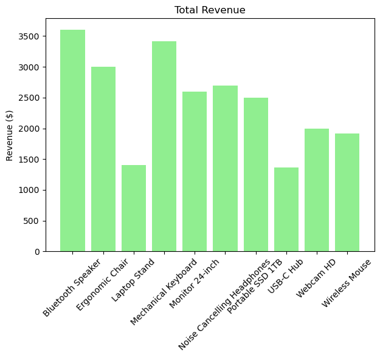
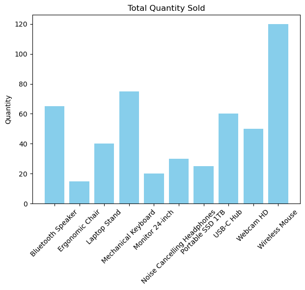

# 📊 Basic Sales Summary using SQLite and Python

This project demonstrates how to perform a simple sales analysis using a local **SQLite** database in Python, and visualize the results using **pandas** and **matplotlib**.

## 🔧 Tools Used
- Python (with built-in `sqlite3`)
- SQLite (`sales_data.db`)
- Pandas
- Matplotlib
- Jupyter Notebook or `.py` script

---

## 📁 Dataset
A small SQLite database named `sales_data.db` containing one table: `sales`.

The `sales` table includes:
- `product` (text)
- `quantity` (integer)
- `price` (real)

---

## 🧠 Objective
- Connect to a SQLite database
- Execute SQL queries to compute:
  - Total quantity sold per product
  - Total revenue per product
- Load query results into a pandas DataFrame
- Display the results using `print()` and a basic bar chart

---

## ✅ Output Example

### 🔍 Printed Sales Summary
The SQL query used:
```sql
SELECT product, 
       SUM(quantity) AS total_qty, 
       SUM(quantity * price) AS revenue 
FROM sales 
GROUP BY product;
```

---

### 📈 Revenue Bar Chart
Visual representation of revenue by product:




---

## 💡 Key Learnings
- Using SQLite with Python for lightweight data analysis
- Writing basic SQL queries in Python
- Integrating SQL results with pandas
- Creating bar charts using matplotlib

---

## 🚀 How to Run
1. Make sure `sales_data.db` is in your working directory.
2. Run the Python script or Jupyter notebook.

---

## 📬 Contact
Feel free to reach out if you have any questions or suggestions!
