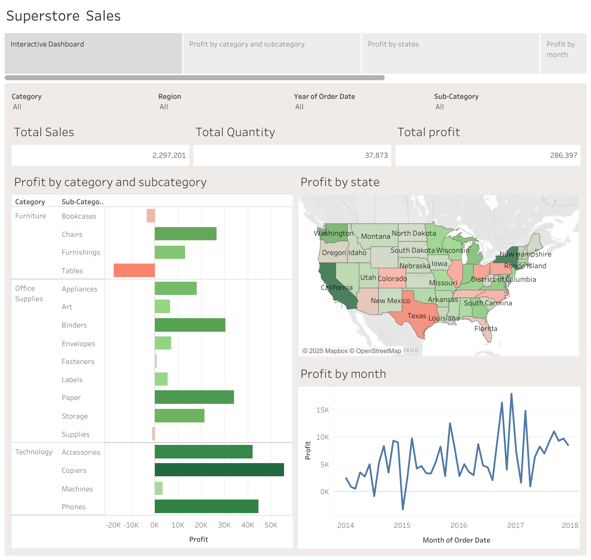

# Super Store Tableau Dashboard

## Overview
This Tableau dashboard provides a comprehensive analysis of profit trends across different dimensions, including:
- **Profit by Category and Sub-Category**: Identifies high and low-performing product segments.
- **Profit by States**: Highlights geographical profit distribution to assess regional performance.
- **Profit by Months**: Displays seasonal trends and variations in profitability.

## Dashboard Preview
  

## Features
- **Interactive Visualizations**: Enables users to explore detailed insights with filter options.
- **Business Intelligence**: Assists in decision-making by showcasing strong and weak profit areas.
- **Trend Analysis**: Helps track profit fluctuations across different time periods and regions.

## Usage
1. Open the Tableau dashboard.
2. Utilize filters to explore data by category, sub-category, state, or month.
3. Analyze trends to enhance business strategies.

## Acknowledgments
This dashboard was designed to provide valuable insights into sales and profit distribution to assist in data-driven decision-making.

---